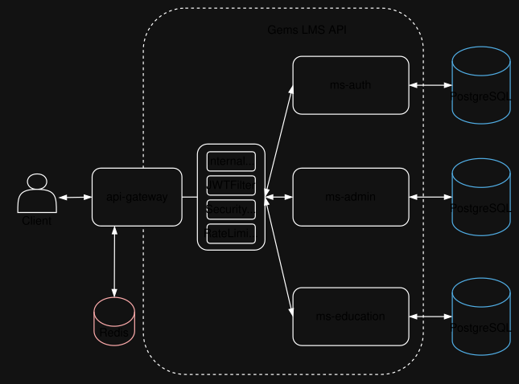

# GEMS LMS API

Sistema de gestión de aprendizaje (LMS) basado en arquitectura de microservicios con Spring Boot, Spring Cloud Gateway y PostgreSQL.

## 🏗️ Arquitectura

### Componentes Principales

El proyecto sigue una **arquitectura de microservicios** basada en **Clean Architecture + DDD (Domain-Driven Design)**:

- **API Gateway**: Punto de entrada único para todas las peticiones
- **Microservicios**: 
  - `ms-auth`: Gestión de autenticación y usuarios
  - `ms-admin`: Gestión administrativa
  - `ms-education`: Gestión educativa
- **Bases de Datos**: Una base de datos PostgreSQL independiente por microservicio
- **Redis**: Servicio de caché y rate limiting
- **Shared Module**: Componentes compartidos entre microservicios

### Estructura de Microservicios

Cada microservicio sigue la estructura de Clean Architecture:

```
ms-[nombre]/
├── domain/              # Capa de dominio (entidades, value objects, excepciones)
├── application/         # Capa de aplicación (use cases, gateways, commands/queries)
└── infrastructure/      # Capa de infraestructura (repositorios, controladores, config)
```

## 📊 Flujo de Información

### 1. Entrada de Petición

Cuando una petición HTTP llega a la aplicación, el flujo es el siguiente:

```
Cliente → API Gateway (Puerto: ${API_GATEWAY_PORT})
```

### 2. Procesamiento en el API Gateway

El API Gateway procesa todas las peticiones a través de una cadena de filtros:

#### Filtros Aplicados (en orden):

1. **SecurityHeadersFilter**: Agrega headers de seguridad HTTP
2. **RateLimitFilter**: Controla el límite de peticiones por cliente usando Redis
3. **JwtAuthenticationFilter**: Valida el token JWT
   - Si la ruta es `/auth/login`, permite el acceso sin token
   - Para otras rutas, extrae y valida el token JWT del header `Authorization`
   - Si es válido, agrega headers internos: `X-User-Id` y `X-User-Role`
   - Si no es válido, retorna `401 Unauthorized`
4. **InternalAuthFilter**: Agrega el token de autenticación interna (`X-Internal-Token`) para comunicación entre el Gateway y los microservicios

### 3. Enrutamiento

El API Gateway utiliza `RouteConfig` para enrutar las peticiones según el path:

- **Rutas `/auth/**`** → Microservicio `ms-auth`
- **Rutas `/admin/**`** → Microservicio `ms-admin`
- **Rutas `/education/**`** → Microservicio `ms-education`

### 4. Llegada al Microservicio

Cuando la petición llega al microservicio:

1. **InternalAuthFilter** (en el microservicio): Valida que el header `X-Internal-Token` coincida con el secreto configurado
   - Si no coincide, retorna `403 Forbidden`
   - Si coincide, permite continuar

2. **JwtValidationFilter**: Valida nuevamente el token JWT y extrae la información del usuario

3. **Controlador REST**: Recibe la petición y utiliza los **Use Cases** para procesar la lógica de negocio

4. **Use Case**: Ejecuta la lógica de negocio utilizando los **Gateways** (interfaces)

5. **Repositorio Adapter**: Implementa los gateways y accede a la base de datos usando R2DBC (programación reactiva)

6. **Respuesta**: El flujo se invierte y retorna la respuesta al cliente a través del API Gateway

### Diagrama de Flujo



## 🚀 Guía de Ejecución

### Prerrequisitos

- Java 24
- IntelliJ Idea Community
- Docker y Docker Compose
- PowerShell (para ejecutar los scripts en Windows)

### 1. Clonar el Repositorio

```bash
git clone <repository-url>
cd gems-lms-api
```

### 2. Subir Docker Compose

El archivo `docker-compose.yml` contiene las configuraciones de las bases de datos y Redis. **NO modificar este archivo**.

Ejecutar:

```bash
docker-compose up -d
```

Esto iniciará:
- `postgres-auth` en el puerto **5432**
- `postgres-auth` en el puerto **5433**
- `postgres-education` en el puerto **5434**
- `redis` en el puerto configurado por `${REDIS_PORT}`

### 3. Crear las Tablas en PostgreSQL

Conectarse a cada instancia de PostgreSQL y ejecutar los scripts `schema.sql` correspondientes.

#### Base de Datos Auth (Puerto 5432)

```bash
psql -h localhost -p 5432 -U auth_user -d auth_db
```

O usando Docker:

```bash
docker exec -i gems-postgres-auth psql -U auth_user -d auth_db < ms-auth/src/main/resources/schema.sql
```

#### Base de Datos Admin (Puerto 5433)

```bash
psql -h localhost -p 5433 -U admin_user -d admin_db
```

O usando Docker:

```bash
docker exec -i gems-postgres-admin psql -U admin_user -d admin_db < ms-admin/src/main/resources/schema.sql
```

#### Base de Datos Education (Puerto 5434)

```bash
psql -h localhost -p 5434 -U education_user -d education_db
```

O usando Docker:

```bash
docker exec -i gems-postgres-education psql -U education_user -d education_db < ms-education/src/main/resources/schema.sql
```

### 4. Crear el Archivo .env

Crear un archivo `.env` en la raíz del proyecto con las siguientes variables de entorno:

```env
API_GATEWAY_PORT=8080
AUTH_PORT=8081
ADMIN_PORT=8082
EDUCATION_PORT=8083

GATEWAY_INTERNAL_SECRET=your-internal-secret-key-here
GATEWAY_INTERNAL_HEADER=X-Internal-Token

JWT_SECRET=your-jwt-secret-key-here-change-in-production
JWT_EXPIRATION=3600000

AUTH_URL=http://localhost:8081
AUTH_ID=auth-service
AUTH_PATH=/auth/**

ADMIN_URL=http://localhost:8082
ADMIN_ID=admin-service
ADMIN_PATH=/admin/**

EDUCATION_URL=http://localhost:8083
EDUCATION_ID=education-service
EDUCATION_PATH=/education/**

AUTH_LOGIN_PATH=/auth/login

REDIS_HOST=localhost
REDIS_PORT=6379
REDIS_PASSWORD=your-redis-password

RATE_LIMIT_REQUESTS=100
RATE_LIMIT_WINDOW=60
RATE_LIMIT_KEY_PREFIX=rate_limit:

AUTH_DB_NAME=auth_db
AUTH_DB_USER=auth_user
AUTH_DB_PASSWORD=auth_password
AUTH_R2DBC_URL=r2dbc:postgresql://localhost:5432/auth_db
AUTH_R2DBC_USERNAME=auth_user
AUTH_R2DBC_PASSWORD=auth_password

ADMIN_DB_NAME=admin_db
ADMIN_DB_USER=admin_user
ADMIN_DB_PASSWORD=admin_password
ADMIN_R2DBC_URL=r2dbc:postgresql://localhost:5433/admin_db
ADMIN_R2DBC_USERNAME=admin_user
ADMIN_R2DBC_PASSWORD=admin_password

EDUCATION_DB_NAME=education_db
EDUCATION_DB_USER=education_user
EDUCATION_DB_PASSWORD=education_password
EDUCATION_R2DBC_URL=r2dbc:postgresql://localhost:5434/education_db
EDUCATION_R2DBC_USERNAME=education_user
EDUCATION_R2DBC_PASSWORD=education_password

CORS_ALLOWED_ORIGINS=http://localhost:3000,http://localhost:4200
CORS_ALLOWED_METHODS=GET,POST,PUT,DELETE,OPTIONS
CORS_ALLOWED_HEADERS=*
CORS_ALLOW_CREDENTIALS=true
CORS_MAX_AGE=3600
```

**Importante**: Cambiar los valores de ejemplo por valores seguros en producción.

### 5. Ejecutar los Microservicios

#### Iniciar Todos los Microservicios

Ejecutar el script `start-microservices.ps1`:

```powershell
.\start-microservices.ps1
```

O especificar que se inicien todos:

```powershell
.\start-microservices.ps1 -Microservice all
```

Esto abrirá ventanas separadas de PowerShell para cada microservicio:
- API Gateway
- ms-auth
- ms-admin
- ms-education

#### Iniciar un Microservicio Específico

Para iniciar solo un microservicio, usar la flag `-Microservice`:

```powershell
.\start-microservices.ps1 -Microservice api-gateway
.\start-microservices.ps1 -Microservice ms-auth
.\start-microservices.ps1 -Microservice ms-admin
.\start-microservices.ps1 -Microservice ms-education
```

#### Detener los Microservicios

Para detener todos los microservicios:

```powershell
.\stop-microservices.ps1
```

O para detener uno específico:

```powershell
.\stop-microservices.ps1 -Microservice api-gateway
.\stop-microservices.ps1 -Microservice ms-auth
.\stop-microservices.ps1 -Microservice ms-admin
.\stop-microservices.ps1 -Microservice ms-education
```

**Nota**: Los scripts PowerShell **NO deben modificarse**.

### 6. Verificar que Todo Funciona

Probar los endpoints de health de cada microservicio:

#### API Gateway
```bash
curl http://localhost:8080/actuator/health
```

#### ms-auth
```bash
curl http://localhost:8081/actuator/health
```

#### ms-admin
```bash
curl http://localhost:8082/actuator/health
```

#### ms-education
```bash
curl http://localhost:8083/actuator/health
```

Si todos responden con estado `UP`, el sistema está funcionando correctamente.

## 📋 Checklist de Pendientes

- [ ] **LOAD BALANCER**: Implementar balanceador de carga para distribuir el tráfico entre múltiples instancias de microservicios

